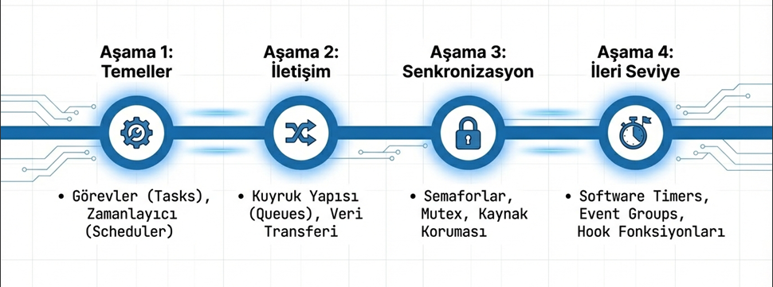

# FreeRTOS STM32 Çalışmaları

Bu repoda STM32 üzerinde FreeRTOS kullanarak yaptığım örnekler yer almaktadır.

## İçerik
- Task kullanımı (Notification , Deletion)
- Queue kullanımı
- Semaphore
- Mutex
- Software Timer
- Hook Functions
- Events

## freeRTOS Yol Haritası

